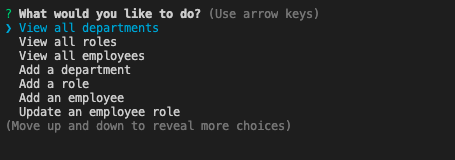
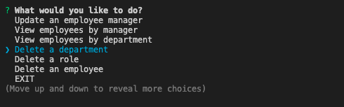
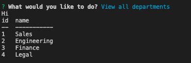
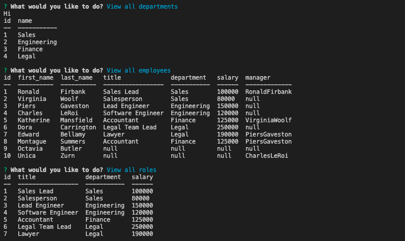

# Employee Tracker

## [Click to watch the Tutorial Video](https://drive.google.com/file/d/1-bqVIk4zc7GhzHUy9IfIa3xG9OgaAVYS/view)

# Description
This program works under the terminal functionality, to start running it we must start with the "npm start" to start the program, after that we will see a series of options and with our arrow keys we can select one of the options to run it, each one Of these, it has different questions that it asks the user and these are stored in our database. The criteria of this program is acceptable for all users to use it. 

## Technology used
* JavaScript
* Inquirer
* Node JS
* MySQL
* Bower

## Screenshots

# Contribution

By Mario Viana
